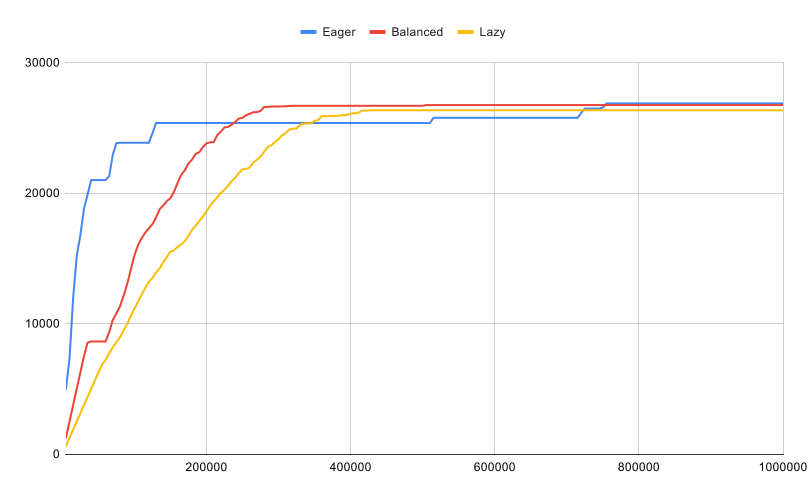

<a title="Build Status" target="_blank" href="https://travis-ci.com/alitto/pond"></a>
<a title="Codecov" target="_blank" href="https://codecov.io/gh/alitto/pond"></a>
<a title="Release" target="_blank" href="https://github.com/alitto/pond/releases"></a>
<a title="Go Report Card" target="_blank" href="https://goreportcard.com/report/github.com/alitto/pond"></a>

# pond
Minimalistic and High-performance goroutine worker pool written in Go

## Motivation

This library is meant to provide a simple way to limit concurrency when executing some function over a limited resource or service.

Some common scenarios include:

 - Executing queries against a Database with a limited no. of connections
 - Sending HTTP requests to a a rate/concurrency limited API

## Features:

- Zero dependencies
- Create pools with fixed or dynamic size
- Worker goroutines are only created when needed (backpressure detection) and automatically purged after being idle for some time (configurable)
- Minimalistic APIs for:
  - Creating worker pools with fixed or dynamic size
  - Submitting tasks to a pool in a fire-and-forget fashion
  - Submitting tasks to a pool and waiting for them to complete
  - Submitting tasks to a pool with a deadline
  - Submitting a group of related tasks and waiting for them to complete
  - Getting the number of running workers (goroutines)
  - Stopping a worker pool
- Task panics are handled gracefully (configurable panic handler)
- Supports Non-blocking and Blocking task submission modes (buffered / unbuffered)
- Very high performance under heavy workloads (See [benchmarks](#benchmarks))
- **New (since v1.3.0)**: configurable pool resizing strategy, with 3 presets for common scenarios: Eager, Balanced and Lazy. 
- [API reference](https://pkg.go.dev/github.com/alitto/pond)

## How to install

```bash
go get -u github.com/alitto/pond
```

## How to use

### Worker pool with dynamic size

``` go
package main

import (
	"fmt"

	"github.com/alitto/pond"
)

func main() {

	// Create a buffered (non-blocking) pool that can scale up to 100 workers
	// and has a buffer capacity of 1000 tasks
	pool := pond.New(100, 1000)

	// Submit 1000 tasks
	for i := 0; i < 1000; i++ {
		n := i
		pool.Submit(func() {
			fmt.Printf("Running task #%d\n", n)
		})
	}

	// Stop the pool and wait for all submitted tasks to complete
	pool.StopAndWait()
}
```

### Worker pool with fixed size

``` go
package main

import (
	"fmt"

	"github.com/alitto/pond"
)

func main() {

	// Create an unbuffered (blocking) pool with a fixed 
	// number of workers
	pool := pond.New(10, 0, pond.MinWorkers(10))

	// Submit 1000 tasks
	for i := 0; i < 1000; i++ {
		n := i
		pool.Submit(func() {
			fmt.Printf("Running task #%d\n", n)
		})
	}

	// Stop the pool and wait for all submitted tasks to complete
	pool.StopAndWait()
}
```

### Submitting groups of related tasks

``` go
package main

import (
	"fmt"

	"github.com/alitto/pond"
)

func main() {

	// Create a pool
	pool := pond.New(10, 1000)
	defer pool.StopAndWait()

	// Create a task group
	group := pool.Group()

	// Submit a group of related tasks
	for i := 0; i < 20; i++ {
		n := i
		group.Submit(func() {
			fmt.Printf("Running group task #%d\n", n)
		})
	}

	// Wait for all tasks in the group to complete
	group.Wait()
}
```

### Pool Configuration Options

- **MinWorkers**: Specifies the minimum number of worker goroutines that must be running at any given time. These goroutines are started when the pool is created. The default value is 0. Example:
``` go
// This will create a pool with 5 running worker goroutines 
pool := pond.New(10, 1000, pond.MinWorkers(5))
```
- **IdleTimeout**: Defines how long to wait before removing idle worker goroutines from the pool. The default value is 5 seconds. Example:
``` go
// This will create a pool that will remove workers 100ms after they become idle 
pool := pond.New(10, 1000, pond.IdleTimeout(100 * time.Millisecond))
``` 
- **PanicHandler**: Allows to configure a custom function to handle panics thrown by tasks submitted to the pool. The default handler just writes a message to standard output using `fmt.Printf` with the following contents: `Worker exits from a panic: [panic] \n Stack trace: [stack trace]`).  Example:
```go
// Custom panic handler function
panicHandler := func(p interface{}) {
	fmt.Printf("Task panicked: %v", p)
}

// This will create a pool that will handle panics using a custom panic handler
pool := pond.New(10, 1000, pond.PanicHandler(panicHandler)))
```
- **Strategy**: Configures the strategy used to resize the pool when backpressure is detected. You can create a custom strategy by implementing the `pond.ResizingStrategy` interface or choose one of the 3 presets:
    - **Eager**: maximizes responsiveness at the expense of higher resource usage, which can reduce throughput under certain conditions. This strategy is meant for worker pools that will operate at a small percentage of their capacity most of the time and may occasionally receive bursts of tasks. This is the default strategy.
	- **Balanced**: tries to find a balance between responsiveness and throughput. It's suitable for general purpose worker pools or those that will operate close to 50% of their capacity most of the time.
	- **Lazy**: maximizes throughput at the expense of responsiveness. This strategy is meant for worker pools that will operate close to their max. capacity most of the time.
``` go
// Example: create pools with different resizing strategies
eagerPool := pond.New(10, 1000, pond.Strategy(pond.Eager()))
balancedPool := pond.New(10, 1000, pond.Strategy(pond.Balanced()))
lazyPool := pond.New(10, 1000, pond.Strategy(pond.Lazy()))
``` 

### Resizing strategies

The following chart illustrates the behaviour of the different pool resizing strategies as the number of submitted tasks increases. Each line represents the number of worker goroutines in the pool (pool size) and the x-axis reflects the number of submitted tasks (cumulative). 



As the name suggests, the "Eager" strategy always spawns an extra worker when there are no idles, which causes the pool to grow almost linearly with the number of submitted tasks. On the other end, the "Lazy" strategy creates one worker every N submitted tasks, where N is the maximum number of available CPUs ([GOMAXPROCS](https://golang.org/pkg/runtime/#GOMAXPROCS)). The "Balanced" strategy represents a middle ground between the previous two because it creates a worker every N/2 submitted tasks.

## API Reference

Full API reference is available at https://pkg.go.dev/github.com/alitto/pond

## Benchmarks

We ran a few [benchmarks](benchmark/benchmark_test.go) to see how _pond_'s performance compares against some of the most popular worker pool libraries available for Go ([ants](https://github.com/panjf2000/ants/) and [gammazero's workerpool](https://github.com/gammazero/workerpool)), as well as just launching unbounded goroutines and manually creating a goroutine worker pool (inspired by [gobyexample.com](https://gobyexample.com/worker-pools)), using either a buffered or an unbuffered channel to dispatch tasks. 

The test consists of submitting 3 different workloads to each worker pool:
- *1M-10ms*: 1 million tasks that sleep for 10 milliseconds (`time.Sleep(10*time.Millisecond)`)
- *100k-500ms*: 100 thousand tasks that sleep for 500 milliseconds (`time.Sleep(500*time.Millisecond)`)
- *10k-1000ms*: 10 thousand tasks that sleep for 1 second (`time.Sleep(1*time.Second)`) 

 All pools are configured to use a maximum of 200k workers and initialization times are taken into account.

Here are the results:

```bash
goos: linux
goarch: amd64
pkg: github.com/alitto/pond/benchmark
1M-10ms/Pond-Eager-8         	       2	 620347142 	82768720 	 1086686 
1M-10ms/Pond-Balanced-8      	       2	 578973910 	81339088 	 1083203 
1M-10ms/Pond-Lazy-8          	       2	 613344573 	84347248 	 1084987 
1M-10ms/Goroutines-8         	       2	 540765682 	98457168 	 1060433 
1M-10ms/GoroutinePool-8      	       1	1157705614 	68137088 	 1409763 
1M-10ms/BufferedPool-8       	       1	1158068370 	76426272 	 1412739 
1M-10ms/Gammazero-8          	       1	1330312458 	34524328 	 1029692 
1M-10ms/AntsPool-8           	       2	 724231628 	37870404 	 1077297 
100k-500ms/Pond-Eager-8      	       2	 604180003 	31523028 	  349877 
100k-500ms/Pond-Balanced-8   	       1	1060079592 	35520416 	  398779 
100k-500ms/Pond-Lazy-8       	       1	1053705909 	35040512 	  392696 
100k-500ms/Goroutines-8      	       2	 551869174 	 8000016 	  100001 
100k-500ms/GoroutinePool-8   	       2	 635442074 	20764560 	  299632 
100k-500ms/BufferedPool-8    	       2	 641683384 	21647840 	  299661 
100k-500ms/Gammazero-8       	       2	 667449574 	16241864 	  249664 
100k-500ms/AntsPool-8        	       2	 659853037 	37300372 	  549784 
10k-1000ms/Pond-Eager-8      	       1	1014320653 	12135080 	   39692 
10k-1000ms/Pond-Balanced-8   	       1	1015979207 	12083704 	   39518 
10k-1000ms/Pond-Lazy-8       	       1	1036374161 	12046632 	   39366 
10k-1000ms/Goroutines-8      	       1	1007837894 	  800016 	   10001 
10k-1000ms/GoroutinePool-8   	       1	1149536612 	21393024 	  222458 
10k-1000ms/BufferedPool-8    	       1	1127286218 	20343584 	  219359 
10k-1000ms/Gammazero-8       	       1	1023249222 	 2019688 	   29374 
10k-1000ms/AntsPool-8        	       1	1016280850 	 4155904 	   59487 
PASS
ok  	github.com/alitto/pond/benchmark	37.331s
```

As you can see, _pond_'s resizing strategies (Eager, Balanced or Lazy) behave differently under different workloads and generally one of them outperforms the other worker pool implementations, except for launching unbounded goroutines.

Leaving aside the fact that launching unlimited goroutines defeats the goal of limiting concurrency over a resource, its performance is highly dependant on how much resources (CPU and memory) are available at a given time, which make it unpredictable and likely to cause starvation. In other words, it's generally not a good idea for production applications.

These tests were executed on a laptop with an 8-core CPU (Intel(R) Core(TM) i7-8550U CPU @ 1.80GHz) and 16GB of RAM.

## Resources

Here are some of the resources which have served as inspiration when writing this library:

- http://marcio.io/2015/07/handling-1-million-requests-per-minute-with-golang/
- https://brandur.org/go-worker-pool
- https://gobyexample.com/worker-pools
- https://github.com/panjf2000/ants
- https://github.com/gammazero/workerpool

## Contribution & Support

Feel free to send a pull request if you consider there's something which can be improved. Also, please open up an issue if you run into a problem when using this library or just have a question.