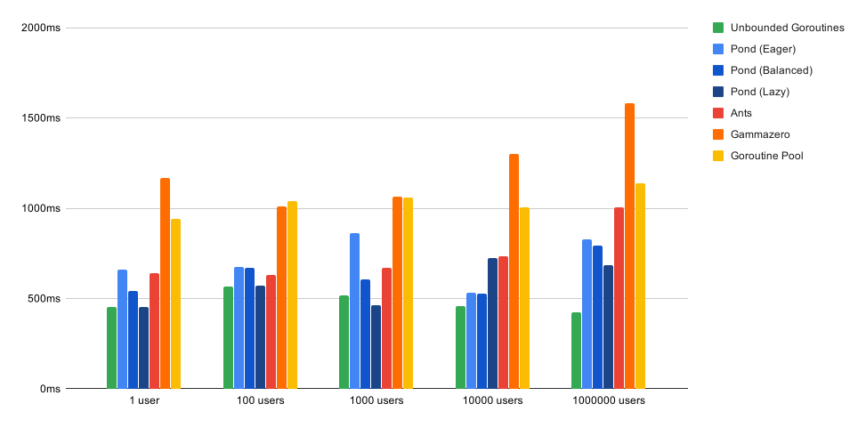
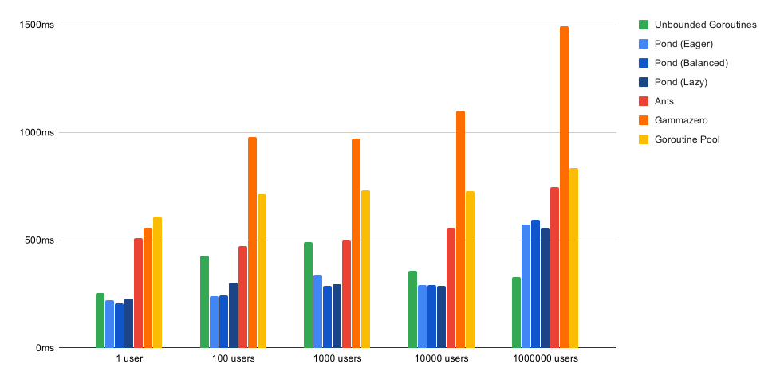
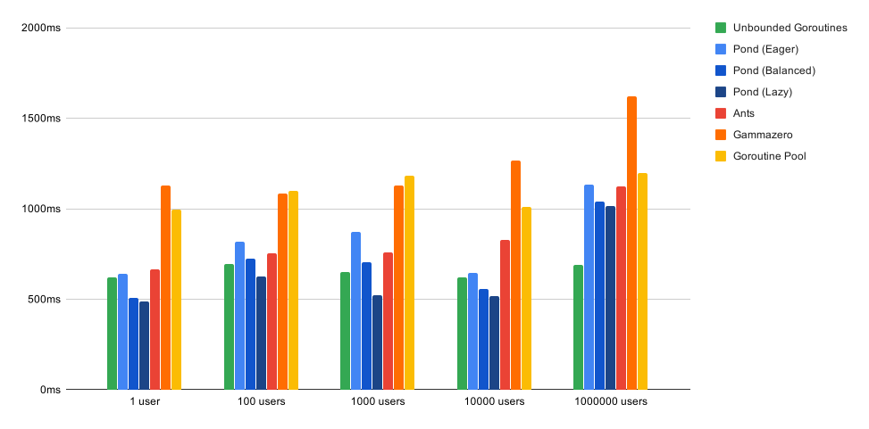

# pond - Benchmarks

We ran a few [benchmarks](./benchmark_test.go) to see how _pond_'s performance compares against some of the most popular worker pool libraries available for Go ([ants](https://github.com/panjf2000/ants/) and [gammazero's workerpool](https://github.com/gammazero/workerpool)), as well as just launching unbounded goroutines or manually creating a goroutine worker pool (inspired by [gobyexample.com](https://gobyexample.com/worker-pools)), using either a buffered or an unbuffered channel to dispatch tasks. 

The test consists of simulating 5 different workload scenarios:
- *1u-10Mt*: 1 user (goroutine) submitting 1 million tasks
- *100u-10Kt*: 100 users submitting 10 thousand tasks each
- *1Ku-1Kt*: 1000 users submitting 1000 tasks each (with a 10ms interval between tasks)
- *10Ku-100t*: 10 thousand users submitting 100 tasks each (with a 10ms interval interval between tasks)
- *1Mu-1t*: 1 million users submitting 1 task each

All pools are configured to use a maximum of 200k workers and initialization times are taken into account.

Here are the results of the benchmark when submitting an asynchronous task that just sleeps for 10ms (`time.Sleep(10 * time.Millisecond)`):



```bash
go test -benchmem -run=^$ github.com/alitto/pond/benchmark -bench '^(BenchmarkAllSleep.*)$' -benchtime=3x -cpu=8
goos: linux
goarch: amd64
pkg: github.com/alitto/pond/benchmark
BenchmarkAllSleep10ms/1u-10Mt/Pond-Eager-8         	       3	 658233743 ns/op	13177872 B/op	   83966 allocs/op
BenchmarkAllSleep10ms/1u-10Mt/Pond-Balanced-8      	       3	 542151290 ns/op	12843525 B/op	   80628 allocs/op
BenchmarkAllSleep10ms/1u-10Mt/Pond-Lazy-8          	       3	 453957719 ns/op	13619120 B/op	   88093 allocs/op
BenchmarkAllSleep10ms/1u-10Mt/Goroutines-8         	       3	 452322853 ns/op	81737360 B/op	 1009514 allocs/op
BenchmarkAllSleep10ms/1u-10Mt/GoroutinePool-8      	       3	 942987920 ns/op	22749680 B/op	  270289 allocs/op
BenchmarkAllSleep10ms/1u-10Mt/BufferedPool-8       	       3	 971651135 ns/op	31039664 B/op	  273297 allocs/op
BenchmarkAllSleep10ms/1u-10Mt/Gammazero-8          	       3	1165440763 ns/op	 2003037 B/op	   24369 allocs/op
BenchmarkAllSleep10ms/1u-10Mt/AntsPool-8           	       3	 640480375 ns/op	 6467578 B/op	   85681 allocs/op
BenchmarkAllSleep10ms/100u-10Kt/Pond-Eager-8       	       3	 674275336 ns/op	34262096 B/op	  420257 allocs/op
BenchmarkAllSleep10ms/100u-10Kt/Pond-Balanced-8    	       3	 668055373 ns/op	26164368 B/op	  325129 allocs/op
BenchmarkAllSleep10ms/100u-10Kt/Pond-Lazy-8        	       3	 570578768 ns/op	19205968 B/op	  200380 allocs/op
BenchmarkAllSleep10ms/100u-10Kt/Goroutines-8       	       3	 566593280 ns/op	100025210 B/op	 1049624 allocs/op
BenchmarkAllSleep10ms/100u-10Kt/GoroutinePool-8    	       3	1037432189 ns/op	22381360 B/op	  266476 allocs/op
BenchmarkAllSleep10ms/100u-10Kt/BufferedPool-8     	       3	 901981176 ns/op	30382512 B/op	  266452 allocs/op
BenchmarkAllSleep10ms/100u-10Kt/Gammazero-8        	       3	1008801867 ns/op	 2371378 B/op	   28852 allocs/op
BenchmarkAllSleep10ms/100u-10Kt/AntsPool-8         	       3	 632685132 ns/op	12738146 B/op	  170562 allocs/op
BenchmarkAllSleep10ms/1Ku-1Kt/Pond-Eager-8         	       3	 860672256 ns/op	33584048 B/op	  466470 allocs/op
BenchmarkAllSleep10ms/1Ku-1Kt/Pond-Balanced-8      	       3	 605668097 ns/op	33586224 B/op	  466493 allocs/op
BenchmarkAllSleep10ms/1Ku-1Kt/Pond-Lazy-8          	       3	 462462043 ns/op	12380016 B/op	   79389 allocs/op
BenchmarkAllSleep10ms/1Ku-1Kt/Goroutines-8         	       3	 516023441 ns/op	80000048 B/op	 1000002 allocs/op
BenchmarkAllSleep10ms/1Ku-1Kt/GoroutinePool-8      	       3	1059879992 ns/op	22381552 B/op	  266478 allocs/op
BenchmarkAllSleep10ms/1Ku-1Kt/BufferedPool-8       	       3	 990989556 ns/op	30387472 B/op	  266503 allocs/op
BenchmarkAllSleep10ms/1Ku-1Kt/Gammazero-8          	       3	1062265159 ns/op	 2400296 B/op	   29203 allocs/op
BenchmarkAllSleep10ms/1Ku-1Kt/AntsPool-8           	       3	 668318364 ns/op	 9868850 B/op	  131752 allocs/op
BenchmarkAllSleep10ms/10Ku-100t/Pond-Eager-8       	       3	 532311024 ns/op	13046192 B/op	   91585 allocs/op
BenchmarkAllSleep10ms/10Ku-100t/Pond-Balanced-8    	       3	 524989416 ns/op	10928912 B/op	   53280 allocs/op
BenchmarkAllSleep10ms/10Ku-100t/Pond-Lazy-8        	       3	 724182859 ns/op	10228752 B/op	   40577 allocs/op
BenchmarkAllSleep10ms/10Ku-100t/Goroutines-8       	       3	 459821171 ns/op	80000048 B/op	 1000002 allocs/op
BenchmarkAllSleep10ms/10Ku-100t/GoroutinePool-8    	       3	1007354405 ns/op	22378448 B/op	  266446 allocs/op
BenchmarkAllSleep10ms/10Ku-100t/BufferedPool-8     	       3	 924880667 ns/op	30383568 B/op	  266463 allocs/op
BenchmarkAllSleep10ms/10Ku-100t/Gammazero-8        	       3	1302254736 ns/op	 2091101 B/op	   25209 allocs/op
BenchmarkAllSleep10ms/10Ku-100t/AntsPool-8         	       3	 735473470 ns/op	11536946 B/op	  150942 allocs/op
BenchmarkAllSleep10ms/1Mu-1t/Pond-Eager-8          	       3	 829461779 ns/op	10932880 B/op	   53259 allocs/op
BenchmarkAllSleep10ms/1Mu-1t/Pond-Balanced-8       	       3	 794574849 ns/op	10551632 B/op	   46156 allocs/op
BenchmarkAllSleep10ms/1Mu-1t/Pond-Lazy-8           	       3	 685584019 ns/op	10807088 B/op	   50711 allocs/op
BenchmarkAllSleep10ms/1Mu-1t/Goroutines-8          	       3	 422483752 ns/op	80000048 B/op	 1000002 allocs/op
BenchmarkAllSleep10ms/1Mu-1t/GoroutinePool-8       	       3	1138926533 ns/op	22380240 B/op	  266464 allocs/op
BenchmarkAllSleep10ms/1Mu-1t/BufferedPool-8        	       3	1139537728 ns/op	30385872 B/op	  266487 allocs/op
BenchmarkAllSleep10ms/1Mu-1t/Gammazero-8           	       3	1580322536 ns/op	36548029 B/op	  334860 allocs/op
BenchmarkAllSleep10ms/1Mu-1t/AntsPool-8            	       3	1005205084 ns/op	34527010 B/op	  455767 allocs/op
PASS
ok  	github.com/alitto/pond/benchmark	138.009s
```

And these are the results of the benchmark when submitting a synchronous task that just calculates a random float64 number between 0 and 1 (`rand.Float64()`):



```bash
go test -benchmem -run=^$ github.com/alitto/pond/benchmark -bench '^(BenchmarkAllRand.*)$' -benchtime=3x -cpu=8
goos: linux
goarch: amd64
pkg: github.com/alitto/pond/benchmark
BenchmarkAllRandFloat64/1u-10Mt/Pond-Eager-8         	       3	 221147440 ns/op	 8024589 B/op	     156 allocs/op
BenchmarkAllRandFloat64/1u-10Mt/Pond-Balanced-8      	       3	 206112267 ns/op	 8014616 B/op	      96 allocs/op
BenchmarkAllRandFloat64/1u-10Mt/Pond-Lazy-8          	       3	 228397720 ns/op	 8014010 B/op	     120 allocs/op
BenchmarkAllRandFloat64/1u-10Mt/Goroutines-8         	       3	 255098957 ns/op	  173648 B/op	     602 allocs/op
BenchmarkAllRandFloat64/1u-10Mt/GoroutinePool-8      	       3	 608808567 ns/op	 6381850 B/op	   66476 allocs/op
BenchmarkAllRandFloat64/1u-10Mt/BufferedPool-8       	       3	 646646774 ns/op	14388720 B/op	   66516 allocs/op
BenchmarkAllRandFloat64/1u-10Mt/Gammazero-8          	       3	 556528977 ns/op	     765 B/op	      14 allocs/op
BenchmarkAllRandFloat64/1u-10Mt/AntsPool-8           	       3	 511636669 ns/op	 1884922 B/op	   25377 allocs/op
BenchmarkAllRandFloat64/100u-10Kt/Pond-Eager-8       	       3	 240239174 ns/op	 8056522 B/op	    1514 allocs/op
BenchmarkAllRandFloat64/100u-10Kt/Pond-Balanced-8    	       3	 244726370 ns/op	 8009328 B/op	     293 allocs/op
BenchmarkAllRandFloat64/100u-10Kt/Pond-Lazy-8        	       3	 302086894 ns/op	 8322613 B/op	    5889 allocs/op
BenchmarkAllRandFloat64/100u-10Kt/Goroutines-8       	       3	 426853026 ns/op	20887664 B/op	   46804 allocs/op
BenchmarkAllRandFloat64/100u-10Kt/GoroutinePool-8    	       3	 713127672 ns/op	 6380848 B/op	   66471 allocs/op
BenchmarkAllRandFloat64/100u-10Kt/BufferedPool-8     	       3	 595125950 ns/op	14385456 B/op	   66482 allocs/op
BenchmarkAllRandFloat64/100u-10Kt/Gammazero-8        	       3	 977617485 ns/op	   13714 B/op	     147 allocs/op
BenchmarkAllRandFloat64/100u-10Kt/AntsPool-8         	       3	 474116870 ns/op	  122397 B/op	    1797 allocs/op
BenchmarkAllRandFloat64/1Ku-1Kt/Pond-Eager-8         	       3	 338964329 ns/op	15464181 B/op	  133763 allocs/op
BenchmarkAllRandFloat64/1Ku-1Kt/Pond-Balanced-8      	       3	 289530482 ns/op	 8005776 B/op	     110 allocs/op
BenchmarkAllRandFloat64/1Ku-1Kt/Pond-Lazy-8          	       3	 294471089 ns/op	 8016704 B/op	     419 allocs/op
BenchmarkAllRandFloat64/1Ku-1Kt/Goroutines-8         	       3	 490915673 ns/op	33891216 B/op	   79199 allocs/op
BenchmarkAllRandFloat64/1Ku-1Kt/GoroutinePool-8      	       3	 732660817 ns/op	 6405008 B/op	   66722 allocs/op
BenchmarkAllRandFloat64/1Ku-1Kt/BufferedPool-8       	       3	 612328640 ns/op	14381232 B/op	   66438 allocs/op
BenchmarkAllRandFloat64/1Ku-1Kt/Gammazero-8          	       3	 973129161 ns/op	   78610 B/op	     823 allocs/op
BenchmarkAllRandFloat64/1Ku-1Kt/AntsPool-8           	       3	 498528201 ns/op	  458680 B/op	    6466 allocs/op
BenchmarkAllRandFloat64/10Ku-100t/Pond-Eager-8       	       3	 292830436 ns/op	 8006517 B/op	     145 allocs/op
BenchmarkAllRandFloat64/10Ku-100t/Pond-Balanced-8    	       3	 290014999 ns/op	 8008160 B/op	     230 allocs/op
BenchmarkAllRandFloat64/10Ku-100t/Pond-Lazy-8        	       3	 288724307 ns/op	 8004794 B/op	      45 allocs/op
BenchmarkAllRandFloat64/10Ku-100t/Goroutines-8       	       3	 359906263 ns/op	 6014704 B/op	   62654 allocs/op
BenchmarkAllRandFloat64/10Ku-100t/GoroutinePool-8    	       3	 727553640 ns/op	 6463184 B/op	   67328 allocs/op
BenchmarkAllRandFloat64/10Ku-100t/BufferedPool-8     	       3	 753007382 ns/op	14385616 B/op	   66484 allocs/op
BenchmarkAllRandFloat64/10Ku-100t/Gammazero-8        	       3	1101229554 ns/op	  400072 B/op	    4172 allocs/op
BenchmarkAllRandFloat64/10Ku-100t/AntsPool-8         	       3	 559372453 ns/op	 3569413 B/op	   48919 allocs/op
BenchmarkAllRandFloat64/1Mu-1t/Pond-Eager-8          	       3	 571780271 ns/op	 8006266 B/op	     104 allocs/op
BenchmarkAllRandFloat64/1Mu-1t/Pond-Balanced-8       	       3	 593644124 ns/op	 8005317 B/op	      76 allocs/op
BenchmarkAllRandFloat64/1Mu-1t/Pond-Lazy-8           	       3	 556206022 ns/op	 8006197 B/op	      83 allocs/op
BenchmarkAllRandFloat64/1Mu-1t/Goroutines-8          	       3	 327126810 ns/op	     784 B/op	       9 allocs/op
BenchmarkAllRandFloat64/1Mu-1t/GoroutinePool-8       	       3	 833617738 ns/op	 6382672 B/op	   66490 allocs/op
BenchmarkAllRandFloat64/1Mu-1t/BufferedPool-8        	       3	 823267182 ns/op	14384528 B/op	   66473 allocs/op
BenchmarkAllRandFloat64/1Mu-1t/Gammazero-8           	       3	1494572327 ns/op	44507208 B/op	  333672 allocs/op
BenchmarkAllRandFloat64/1Mu-1t/AntsPool-8            	       3	 745656046 ns/op	13846717 B/op	  187657 allocs/op
PASS
ok  	github.com/alitto/pond/benchmark	93.386s
```

As you can see, _pond_'s resizing strategies (Eager, Balanced or Lazy) behave differently under different workloads and generally one or more of these strategies outperform all the other worker pool implementations, except for unbounded goroutines.

Leaving aside the fact that launching unlimited goroutines defeats the goal of limiting concurrency over a resource, its performance is highly dependant on how much resources (CPU and memory) are available at a given time, which make it unpredictable and likely to cause starvation. In other words, it's generally not a good idea for production applications.

We also wanted to see how _pond_ behaves when resources are more constrained, so we repeated the asynchrounous task benchmark (Sleep 10ms), but this time using only 4 CPUs:



```bash
go test -benchmem -run=^$ github.com/alitto/pond/benchmark -bench '^(BenchmarkAllSleep.*)$' -benchtime=3x -cpu=4
goos: linux
goarch: amd64
pkg: github.com/alitto/pond/benchmark
BenchmarkAllSleep10ms/1u-10Mt/Pond-Eager-4         	       3	 638667560 ns/op	15940784 B/op	  121808 allocs/op
BenchmarkAllSleep10ms/1u-10Mt/Pond-Balanced-4      	       3	 509435739 ns/op	14681840 B/op	  104546 allocs/op
BenchmarkAllSleep10ms/1u-10Mt/Pond-Lazy-4          	       3	 487545047 ns/op	12332784 B/op	   72090 allocs/op
BenchmarkAllSleep10ms/1u-10Mt/Goroutines-4         	       3	 622864989 ns/op	81063184 B/op	 1005595 allocs/op
BenchmarkAllSleep10ms/1u-10Mt/GoroutinePool-4      	       3	 993853972 ns/op	23036848 B/op	  273264 allocs/op
BenchmarkAllSleep10ms/1u-10Mt/BufferedPool-4       	       3	1021714262 ns/op	30799696 B/op	  270772 allocs/op
BenchmarkAllSleep10ms/1u-10Mt/Gammazero-4          	       3	1130426539 ns/op	 2032146 B/op	   24702 allocs/op
BenchmarkAllSleep10ms/1u-10Mt/AntsPool-4           	       3	 665803493 ns/op	 5754085 B/op	   76788 allocs/op
BenchmarkAllSleep10ms/100u-10Kt/Pond-Eager-4       	       3	 818847588 ns/op	35801530 B/op	  414175 allocs/op
BenchmarkAllSleep10ms/100u-10Kt/Pond-Balanced-4    	       3	 723634296 ns/op	33384848 B/op	  419312 allocs/op
BenchmarkAllSleep10ms/100u-10Kt/Pond-Lazy-4        	       3	 626540143 ns/op	21113296 B/op	  233346 allocs/op
BenchmarkAllSleep10ms/100u-10Kt/Goroutines-4       	       3	 695757011 ns/op	110921904 B/op	 1071440 allocs/op
BenchmarkAllSleep10ms/100u-10Kt/GoroutinePool-4    	       3	1099938785 ns/op	22391664 B/op	  266583 allocs/op
BenchmarkAllSleep10ms/100u-10Kt/BufferedPool-4     	       3	 933443662 ns/op	30395696 B/op	  266589 allocs/op
BenchmarkAllSleep10ms/100u-10Kt/Gammazero-4        	       3	1082238814 ns/op	 2753992 B/op	   33478 allocs/op
BenchmarkAllSleep10ms/100u-10Kt/AntsPool-4         	       3	 753962177 ns/op	11095693 B/op	  145928 allocs/op
BenchmarkAllSleep10ms/1Ku-1Kt/Pond-Eager-4         	       3	 873225582 ns/op	33593424 B/op	  466568 allocs/op
BenchmarkAllSleep10ms/1Ku-1Kt/Pond-Balanced-4      	       3	 706629572 ns/op	32765488 B/op	  449318 allocs/op
BenchmarkAllSleep10ms/1Ku-1Kt/Pond-Lazy-4          	       3	 522098721 ns/op	15020368 B/op	  126808 allocs/op
BenchmarkAllSleep10ms/1Ku-1Kt/Goroutines-4         	       3	 648364814 ns/op	80000048 B/op	 1000002 allocs/op
BenchmarkAllSleep10ms/1Ku-1Kt/GoroutinePool-4      	       3	1180177588 ns/op	22390960 B/op	  266576 allocs/op
BenchmarkAllSleep10ms/1Ku-1Kt/BufferedPool-4       	       3	1025670406 ns/op	30396112 B/op	  266593 allocs/op
BenchmarkAllSleep10ms/1Ku-1Kt/Gammazero-4          	       3	1129172776 ns/op	 3025912 B/op	   36777 allocs/op
BenchmarkAllSleep10ms/1Ku-1Kt/AntsPool-4           	       3	 758293957 ns/op	 7629184 B/op	  102991 allocs/op
BenchmarkAllSleep10ms/10Ku-100t/Pond-Eager-4       	       3	 645076503 ns/op	16746768 B/op	  159207 allocs/op
BenchmarkAllSleep10ms/10Ku-100t/Pond-Balanced-4    	       3	 554829418 ns/op	13056176 B/op	   91944 allocs/op
BenchmarkAllSleep10ms/10Ku-100t/Pond-Lazy-4        	       3	 514715338 ns/op	11595344 B/op	   65146 allocs/op
BenchmarkAllSleep10ms/10Ku-100t/Goroutines-4       	       3	 618594640 ns/op	80000048 B/op	 1000002 allocs/op
BenchmarkAllSleep10ms/10Ku-100t/GoroutinePool-4    	       3	1009094159 ns/op	22391344 B/op	  266580 allocs/op
BenchmarkAllSleep10ms/10Ku-100t/BufferedPool-4     	       3	 888272088 ns/op	30393360 B/op	  266565 allocs/op
BenchmarkAllSleep10ms/10Ku-100t/Gammazero-4        	       3	1264327736 ns/op	 2760306 B/op	   33330 allocs/op
BenchmarkAllSleep10ms/10Ku-100t/AntsPool-4         	       3	 825426536 ns/op	12383949 B/op	  166217 allocs/op
BenchmarkAllSleep10ms/1Mu-1t/Pond-Eager-4          	       3	1133354687 ns/op	10757456 B/op	   50026 allocs/op
BenchmarkAllSleep10ms/1Mu-1t/Pond-Balanced-4       	       3	1040441038 ns/op	10220784 B/op	   40357 allocs/op
BenchmarkAllSleep10ms/1Mu-1t/Pond-Lazy-4           	       3	1015159406 ns/op	10172880 B/op	   39428 allocs/op
BenchmarkAllSleep10ms/1Mu-1t/Goroutines-4          	       3	 687813489 ns/op	80000048 B/op	 1000002 allocs/op
BenchmarkAllSleep10ms/1Mu-1t/GoroutinePool-4       	       3	1196809101 ns/op	30276560 B/op	  287129 allocs/op
BenchmarkAllSleep10ms/1Mu-1t/BufferedPool-4        	       3	1258868445 ns/op	30664016 B/op	  267309 allocs/op
BenchmarkAllSleep10ms/1Mu-1t/Gammazero-4           	       3	1620357479 ns/op	33538610 B/op	  345372 allocs/op
BenchmarkAllSleep10ms/1Mu-1t/AntsPool-4            	       3	1123553898 ns/op	30075709 B/op	  391551 allocs/op
PASS
ok  	github.com/alitto/pond/benchmark	152.726s
```

When running with fewer available CPUs, the difference becomes more clear when comparing against other worker pool implementations and it even runs faster than launching unbounded goroutines in some of the workloads (when users <= 10k).

These tests were executed on a laptop with an 8-core CPU (Intel(R) Core(TM) i7-8550U CPU @ 1.80GHz) and 16GB of RAM.
